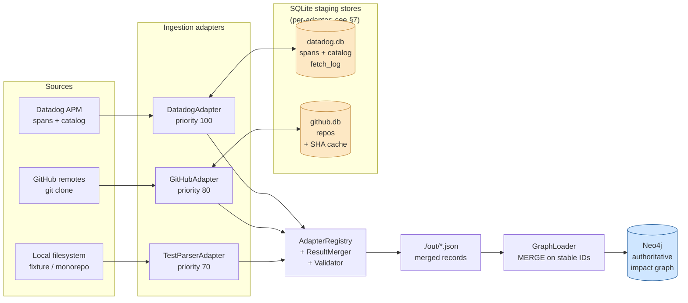
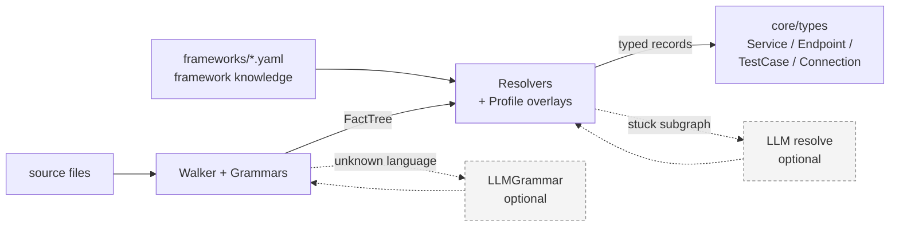
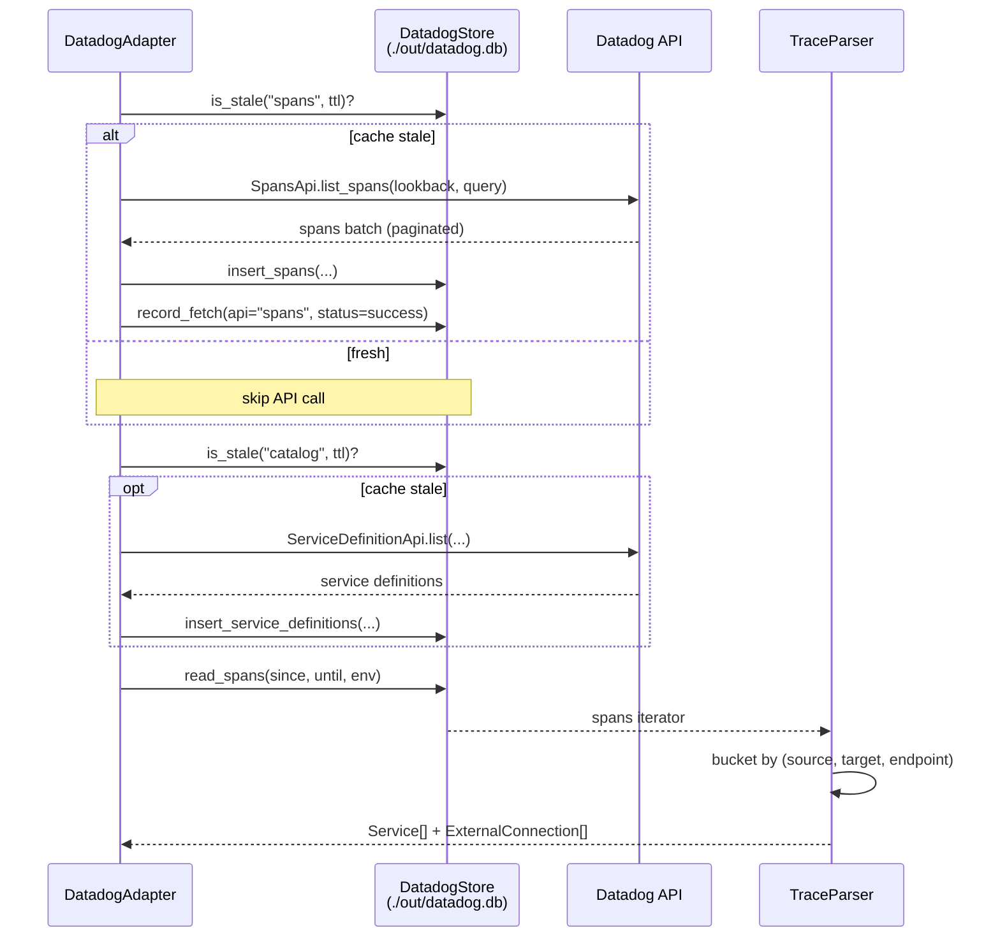
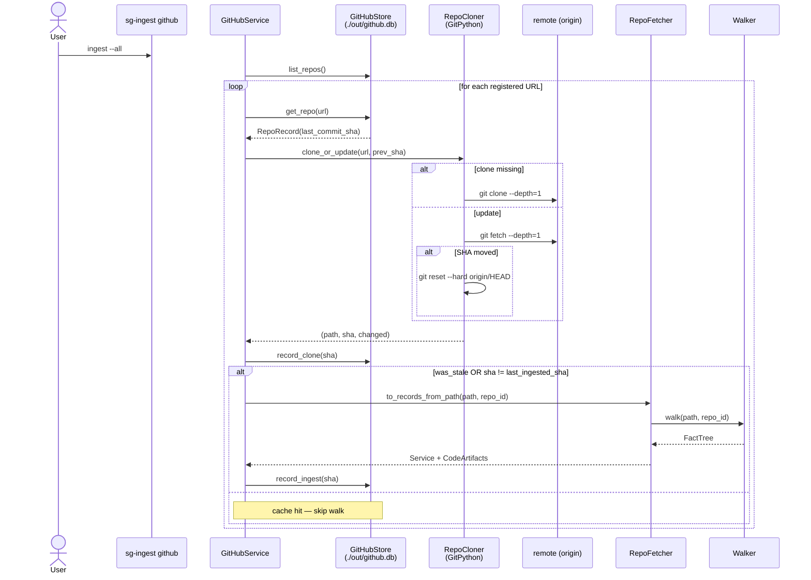
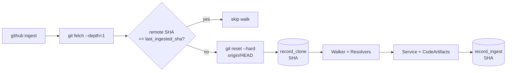

# system-graph: Architecture

This document describes the design that's actually built today (Phase 1 + Phase 1.5). The original 13-week roadmap lives in `complete_system_design.md` and `QUICK_REFERENCE.md`; what follows is the concrete implementation, the *why* behind the structural choices, and the seams you'd extend.

If you only have five minutes, read [§2 The Pipeline](#2-the-pipeline) and [§6 End-to-End Flow](#6-end-to-end-flow-analyzing-a-repo). Diagrams in this doc are Mermaid — they render inline on GitHub and in most Markdown viewers.

### System at a glance



Two persistence layers, two roles:

* **SQLite staging stores** (one per adapter that needs caching) hold raw upstream data — Datadog spans, registered GitHub repos and their SHAs. They exist so we can re-parse / re-walk without re-burning API quota or re-cloning. Schema lives next to the adapter that owns it.
* **Neo4j** is the single authoritative graph: cross-adapter records, MERGEd on stable IDs, queried for impact analysis. Adapters never write here directly — only the loader does, after merge + validation.

---

## 1. What system-graph does

system-graph is a smart-test-selection backbone. The pitch in one paragraph:

> A developer pushes to one service in a polyrepo. Most CI systems then run *every* test, taking 5–10 minutes. system-graph instead builds a Neo4j graph of which services actually talk to which (sourced from Datadog APM traces + source-code analysis), figures out which downstream services a change affects, picks the minimum test set that covers the impact, and returns it to the CI runner. Target: 5 min → 1 min CI time.

Phase 1 ships the **ingestion layer** that produces this graph's input data. Phase 1.5 (just landed) refactors that ingestion into a stage-separated pipeline where framework knowledge lives in declarative YAML and meaning is reconstructed across files — not regex-matched per file.

Later phases (Neo4j loader, rule engine, test selector, FastAPI, webhook, dashboard) are not built yet.

---

## 2. The Pipeline

Phase 1.5's central insight: **separate fact extraction from meaning, and treat framework knowledge as data, not code.**



Three stages:

1. **Walker + Grammars.** The walker walks the file tree, dispatches each file to a `Grammar` by extension, and accumulates atomic `Fact` records into a `FactTree`. A `Fact` is uninterpreted: `Fact(kind=DECORATOR, file="x.py", line=42, data={"callee":"router.get","args":["/users"],…})` says only "this decorator was used here with these args" — never "this is a route".

2. **Framework definitions (YAML).** What makes a decorator a route, an annotation a test, an import an external system, a config key a base-path source — all data, all in `frameworks/*.yaml`. Adding a language is a YAML drop (optionally plus a `Grammar`). No parser code edits.

3. **Resolvers.** Consume `(FactTree, frameworks)` and produce typed records. `TestResolver` outputs `TestCase`. `EndpointResolver` joins config base paths + mount-call prefixes + class annotations + method decorators across files to produce full HTTP endpoint paths. Each emitted record carries a `derivation` tuple of fact IDs — the audit trail.

The shape of typed records (`Service`, `ExternalConnection`, `CodeArtifact`, `TestCase`, etc., in `core/types/`) is the public contract. Phase 2 (Neo4j) is what consumes them.

---

## 3. Why this shape

Two structural problems with the original Phase 1 parser layer drove the refactor:

**Problem 1 — framework knowledge was scattered.**
Test markers in `classifier.py`. External-library names in `python_parser.py` and (separately) `java_parser.py`. Test-path conventions in `adapter.py`. Mock patterns in two parsers. Adding Go meant editing five files. Updating "what counts as external" meant editing two and remembering the second.

**Problem 2 — meaning is cross-file.**
A Spring endpoint is `application.yml:server.servlet.context-path` + `@RequestMapping("/api")` on the controller class + `@GetMapping("/{id}")` on the method. A FastAPI endpoint is `root_path=` arg to `FastAPI(...)` + `include_router(prefix=…)` somewhere else + `@router.get(…)` somewhere else. A per-file regex parser **structurally cannot** reconstruct these. You need to look across the whole tree and join.

The pipeline fixes both:
- Knowledge sits in `frameworks/*.yaml` — one place per framework.
- The `FactTree` is the cross-file substrate; resolvers query it like a database.

This split also makes the LLM layer cheap: the LLM doesn't have to "read the code and decide" — it produces *facts* (extending hardcoded grammars) or *overlay rules* (extending the YAML library), which deterministic resolvers then consume. The LLM teaches the system about an in-house framework once; subsequent runs are deterministic.

---

## 4. Component reference

| Package | Purpose | Key files |
|---|---|---|
| `core/types/` | Domain model (Pydantic v2, frozen) | `service.py` (`Service`, `ExternalConnection`, `CodeArtifact`, `TestCase`), `change.py` (`Change`, `ImpactAnalysisResult`), `errors.py` |
| `core/facts/` | Atomic facts + indexed tree | `fact.py` (`Fact`, `FactKind`), `tree.py` (`FactTree` with `where`, `symbol_at`, `enclosing_class`) |
| `core/frameworks/` | YAML-loaded framework knowledge | `definition.py` (schema), `library.py` (loader), `detector.py` (which framework applies?), `overlay.py` (`RepoOverlay`), `effective.py` (`compose(definition, overlay)`) |
| `core/walker/` | File-tree traversal | `walker.py` (`Walker.walk(root, repo_id) → FactTree`) |
| `core/resolvers/` | Meaning reconstruction | `test_resolver.py`, `endpoint_resolver.py`, `resolver.py` (`ResolverContext`) |
| `core/llm/` | LLM abstraction (NullClient default) | `client.py` (`LLMClient` ABC), `null_client.py`, `budgets.py`, `cache.py` (`FileCache`, `NullCache`) |
| `core/adapters/` | Adapter framework (unchanged from Phase 1) | `base.py` (`IngestionAdapter` ABC), `registry.py`, `merger.py`, `validator.py`, `mapper.py`, `confidence_scorer.py` |
| `core/config/` | Env-driven settings | `settings.py` (`Neo4jSettings`, `DatadogSettings`, `GitHubSettings`, `TestParserSettings`) |
| `ingestion/grammars/` | Per-language fact extractors | `python_grammar.py`, `java_grammar.py`, `config_grammar.py`, `llm_grammar.py`, `grammar.py` (ABC) |
| `ingestion/adapters/datadog/` | APM trace ingestion (bypasses Walker — its input is spans, not files) | `adapter.py`, `client.py`, `trace_parser.py`, `fetcher.py`, `parser.py`, `store.py`, `migrations/` |
| `ingestion/adapters/github/` | Clone-based ingestion + SHA cache + walker/resolver pipeline | `adapter.py`, `service.py`, `cloner.py`, `store.py`, `repo_fetcher.py`, `migrations/` |
| `ingestion/adapters/testparser/` | Local filesystem walker/resolver pipeline | `adapter.py`, `config.py` |
| `frameworks/` (repo root) | YAML knowledge base | `python.yaml`, `java.yaml`, `fastapi.yaml`, `flask.yaml`, `spring.yaml`, `pytest.yaml` |

---

## 5. Fact kinds (the vocabulary)

`FactKind` (in `core/facts/fact.py`) is small on purpose. Each kind has a fixed-ish `data` payload:

| Kind | Emitted by | `data` shape (relevant keys) |
|---|---|---|
| `SYMBOL` | Python/Java grammars | `sym_kind` (`function`/`method`/`field`), `name`, `enclosing_class`, `is_async` |
| `CLASS_DEF` | Python/Java grammars | `name`, `bases`, `kind` (`class`/`interface`), `modifiers` |
| `DECORATOR` | Python grammar | `callee` (e.g. `router.get`), `args`, `kwargs`, `target_symbol`, `target_line` |
| `ANNOTATION` | Java grammar | `callee` (e.g. `GetMapping`), `qualified`, `args`, `kwargs`, `target_symbol`, `target_type`, `target_kind` (`class`/`method`/`field`) |
| `IMPORT` | Python/Java grammars | `module`, `names`, `alias`, `level` |
| `CALL` | Python/Java grammars | `callee`, `receiver`, `method`, `args`, `kwargs` |
| `CONFIG_VALUE` | Config grammar | `key` (dotted), `value` (string), `format` (`yaml`/`toml`/…) |
| `STRING_LITERAL` | reserved for future use | — |
| `TYPE_REFERENCE` | reserved for future use | — |

`Fact.id` is a stable SHA-1 over `(kind, file, line, data)` — used in resolver `derivation` tuples.

Critical query methods on `FactTree`:
- `where(kind=…, file=…)` — indexed buckets.
- `symbol_at(file, line_after)` — "the nearest function/class def at-or-below this line". Used to attach a decorator/annotation to its target symbol.
- `enclosing_class(symbol)` — "the deepest class whose line range covers this symbol". Used to find `@RequestMapping` on a controller class given the method handler.

---

## 6. End-to-end flow: analyzing a repo

This is what happens when you run `sg-ingest run`.

### 6.1 Entry

`ingestion/cli.py:run`

```
sg-ingest run --out ./out
  │
  ├─ get_settings() reads .env via pydantic-settings (core/config/settings.py)
  ├─ AdapterRegistry()
  ├─ _register_adapters(registry, settings, skipped):
  │     ├─ DatadogAdapter    (priority 100) — if DD_API_KEY + DD_APP_KEY
  │     ├─ GitHubAdapter     (priority 80)  — if GITHUB_TOKEN + GITHUB_REPOS
  │     └─ TestParserAdapter (priority 70)  — if TESTPARSER_ROOT exists
  └─ registry.run_all(IngestionContext()) → RunReport
```

`AdapterRegistry.run_all` (`core/adapters/registry.py`) sorts adapters by `priority` descending, runs each, isolates failures (one adapter raising never kills the others), then merges + validates.

### 6.2 Three adapter inputs, one shared pipeline downstream

**DatadogAdapter** — different shape because the input is API spans, not files. Uses the [staging store](#7-staging-stores-the-second-db) to decouple fetch from parse.



No Walker, no Facts, no Resolvers. Datadog tells us *what actually got called in production*; the source-code adapters tell us *what exists statically*. The fetch/parse split lets you iterate on parser logic (`sg-ingest datadog-parse`) without re-pulling spans.

**GitHubAdapter** — clones repos shallowly into a local cache, then hands the on-disk path to the shared pipeline. The metadata store (`./out/github.db`) remembers the SHA we last ingested per repo so unchanged remotes are skipped entirely.



Key properties:

* **Idempotent.** Re-running with no upstream change is a no-op (the staging store's `last_ingested_sha == last_commit_sha` check fires before the walk; the loader's `MERGE (n {id: …})` would absorb duplicates anyway, but we avoid the work).
* **Two-phase commit.** `record_clone` runs as soon as we know the SHA; `record_ingest` only runs after records have been built. A crash between the two leaves the next run with `last_ingested_sha != last_commit_sha` and it retries.
* **Token hygiene.** When `GITHUB_TOKEN` is set, it's injected at fetch time (`https://x-access-token:<token>@github.com/…`) and scrubbed from `.git/config` immediately after. It never persists on disk.

**TestParserAdapter** — walks a local filesystem path containing one or more checked-out repos as subdirectories. No staging store; the source-of-truth is your working tree.

```
TestParserAdapter.extract(ctx)                          # ingestion/adapters/testparser/adapter.py
  ├─ _discover_repos(root, context.repos) — auto-detect single-repo vs parent-of-repos
  └─ for each repo_dir:
        ├─ Walker.walk(repo_dir, repo_id)   ┐
        ├─ detect_frameworks(tree, library) │  same shared pipeline as GitHub
        ├─ TestResolver.resolve(ctx)        │
        └─ result.tests.extend(tests)
```

### 6.3 The shared pipeline (Walker → Facts → Resolvers)

This block is identical for the GitHub and TestParser paths past the input stage.

#### Step A — Walker dispatches to Grammars

`core/walker/walker.py`

```python
Walker.walk(root, repo_id) -> FactTree:
    for file in root.rglob("*"):
        if any path part in excluded_dirs: skip      # .git, .venv, node_modules, …
        if size > max_file_bytes: skip               # default 1 MB; guards against binaries
        grammar = _grammar_for(file)                 # by suffix
        if grammar is None: skip
        tree.extend(grammar.extract(file, content, repo_id=repo_id))
```

Dispatch priority (first match wins):
1. `PythonGrammar` claims `.py`
2. `JavaGrammar` claims `.java`
3. `ConfigGrammar` claims `.yaml`/`.yml`/`.toml`/`.properties`/`.env`/`.json`
4. `LLMGrammar` (optional) claims whatever extensions it was configured with — typically the catch-all for unknown languages

The walker doesn't decide "is this a test?" or "is this an endpoint?" It just turns files into facts.

#### Step B — Grammars emit Facts

Each grammar is a translator. Same contract:

```python
class Grammar(ABC):
    suffixes: tuple[str, ...]
    def extract(self, file: Path, content: str, *, repo_id: str) -> list[Fact]: ...
```

Example output for a Spring `UserController.java`:

```
Fact(IMPORT,     line=2,  module="org.springframework.web.bind.annotation.RestController")
Fact(IMPORT,     line=3,  module="org.springframework.web.bind.annotation.RequestMapping")
Fact(CLASS_DEF,  line=7,  name="UserController")
Fact(ANNOTATION, line=5,  callee="RestController",  target_kind="class",  target_symbol="UserController")
Fact(ANNOTATION, line=6,  callee="RequestMapping",  args=["/users"],
                          target_kind="class",       target_symbol="UserController")
Fact(SYMBOL,     line=9,  sym_kind="method", name="getUser")
Fact(ANNOTATION, line=8,  callee="GetMapping",      args=["/{id}"],
                          target_kind="method",      target_symbol="getUser")
```

And meanwhile `ConfigGrammar.extract(application.yml)` emitted:

```
Fact(CONFIG_VALUE, file="application.yml", key="server.servlet.context-path", value="/v2")
```

Grammars never raise on malformed input — they return `[]`. One broken file shouldn't kill the walk.

#### Step C — Detect which frameworks apply

`core/frameworks/detector.py`

```python
detect_frameworks(tree, library) -> list[FrameworkDefinition]
  for each FrameworkDefinition fw in library:
    for each DetectorRule in fw.detectors (OR'd):
      if any IMPORT fact's module starts with rule.any_import_starts_with: MATCH
      if any CONFIG_VALUE key starts with rule.any_config_key:             MATCH
      if any tree file matches rule.any_file_glob:                         MATCH
```

Our Spring repo above matches `java` (any `.java` file), `spring` (imports `org.springframework`, has `spring.`/`server.` config keys), but not `python`, `fastapi`, `flask`, or `pytest`.

#### Step D — Compose stock + per-repo overlay

`core/frameworks/effective.py`

```python
compose(definition, overlay) -> EffectiveFramework
  tests.decorator_callees ← stock ∪ overlay.test_annotations
  mocks.field_annotations ← stock ∪ overlay.mock_annotations
  http_clients.external_modules ← (stock ∪ overlay.external_modules) − overlay.internal_test_wrappers
  routes ← stock (unchanged)
```

Today `overlay` is always `None` (no LLM provider wired yet), so this is a passthrough. When the profile-learner lands, this is where in-house wrappers (`acme.http.client` wrapping `httpx`) get folded into the effective external-modules set, per repo.

#### Step E — Resolvers produce typed records

**TestResolver** (`core/resolvers/test_resolver.py`)

For every `SYMBOL` fact whose `sym_kind` is `function` or `method`:

```
decorators_on_symbol = ANNOTATION/DECORATOR facts in same file with
                       data.target_symbol == symbol.name

is_test:
    name.startswith(any "test_" prefix from python.yaml / pytest.yaml)
    OR decorators ∩ test annotations from java.yaml / pytest.yaml

classify:
    e2e marker OR tests/e2e/ path             → E2E
    integration marker                        → INTEGRATION
    imports ∩ external_modules − mocked       → INTEGRATION
    tests/integration/ path                   → INTEGRATION
    tests/component/ path                     → COMPONENT
    otherwise                                 → UNIT

emit TestCase(id, repo_id, type, name, file, line_range, …)
```

Note: the "mocked" set for a file resolves Java's simple-name mocks (`@Mock OkHttpClient`) back to the import module (`okhttp3`), so the external-module intersection sees the mock and demotes back to UNIT.

**EndpointResolver** (`core/resolvers/endpoint_resolver.py`)

Python (FastAPI/Flask):
```
base_path:
    look up CALL fact callee=="FastAPI", kwargs["root_path"]    → "/v1"

mount_prefixes:
    look up CALL facts method=="include_router"
    args[router_arg] = "<name:router>" (placeholder for the variable)
    kwargs["prefix"]                                            → {"router": ("/payments", call_id)}

for each DECORATOR fact matching "{any}.get" / "{any}.post" / …:
    callee = "router.get" → method="get", receiver="router"
    path = first string arg starting with "/"                   → "/charges/{id}"
    prefix = mount_prefixes["router"][0]                        → "/payments"
    handler = tree.symbol_at(file, line_after=dec.line)         → "get_charge"
    full_path = _join(base_path, prefix, "", path)              → "/v1/payments/charges/{id}"
    emit ResolvedEndpoint(
      method="GET",
      full_path="/v1/payments/charges/{id}",
      handler_symbol="get_charge",
      derivation=(base_call_id, mount_call_id, dec_id, handler_id),
    )
```

Java (Spring):
```
base_path:
    look up CONFIG_VALUE fact key=="server.servlet.context-path"  → "/v2"

class_prefixes (indexed):
    ANNOTATION facts callee=="RequestMapping" AND target_kind=="class"
    keyed by (file, target_symbol)                                 → {(file, "UserController"): ("/users", ann_id)}

for each method-level ANNOTATION callee in (GetMapping, PostMapping, …):
    path = first string arg                                        → "/{id}"
    handler = SYMBOL fact in same file with name == target_symbol  → "getUser"
    class = tree.enclosing_class(handler)                          → CLASS_DEF "UserController"
    class_prefix = class_prefixes[(file, "UserController")][0]     → "/users"
    full_path = _join(base_path, class_prefix, "", path)           → "/v2/users/{id}"
    emit ResolvedEndpoint("GET", "/v2/users/{id}", "getUser", derivation=…)
```

Every resolver output carries a `derivation: tuple[str, ...]` of fact IDs. When a stakeholder asks *"why did we resolve this endpoint to `/v1/payments/charges/{id}`?"*, the answer is `tree.get(fact_id)` for each entry.

### 6.4 Merge, validate, serialize

Back in `AdapterRegistry.run_all`:

```
report.results = [datadog_result, github_result, testparser_result]   # priority order
  │
  ├─ ResultMerger.merge(results)                         core/adapters/merger.py
  │     dedupe by ID; higher-priority adapter wins; log conflicts
  │
  ├─ ResultValidator.validate(merged)                    core/adapters/validator.py
  │     ERROR: connection.source_service_id not in services    (dangling — blocks load)
  │     WARN:  connection.target_service_id not in services    (3rd-party external resource)
  │     WARN:  artifact.repo_id / test.repo_id not in services (partial run)
  │     WARN:  service has no tests
  │
  └─ RunReport{results, merged, validation, failures, started_at, finished_at}
```

The CLI writes `merged` to `./out/{services,connections,artifacts,tests}.json` and exits non-zero if there are errors or adapter failures.

---

## 7. Staging stores (the "second DB")

Two persistence layers coexist by design:

| Layer | Lives at | Owner | Role |
|---|---|---|---|
| **Neo4j** | `bolt://…` | `core/graph/loader.py` | One authoritative impact graph. Merged from all adapters. MERGE on stable IDs — idempotent re-load. |
| **SQLite staging stores** | `./out/*.db` (one file per adapter) | each adapter's `store.py` | Raw upstream data, kept locally so parsing can be replayed without re-hitting the source. |

Why a second DB at all? Three concrete problems it solves:

1. **API quota.** Datadog charges by query. Pulling 24h of spans takes minutes; iterating on the parser would burn the same quota over and over. The staging store lets `datadog-fetch` run once and `datadog-parse` run a thousand times.
2. **Network cost.** A real-world `git clone` of a large monorepo can be hundreds of MB. The SHA cache lets us skip the whole walk when the remote hasn't moved.
3. **Replay + audit.** A bug in a resolver should be reproducible offline. Holding the raw inputs locally — span by span, file by file — turns parser bugs into unit tests instead of "I'll go pull yesterday's data again".

### 7.1 Common shape

Each adapter that needs caching ships its own SQLite file plus a `migrations/` directory of numbered `.sql` files. The runner is the same in every adapter (`store.py:_run_migrations` mirrors across the package):

```mermaid
flowchart TB
    Open[GitHubStore('./out/github.db')]
    Open --> Check{_migrations<br/>table exists?}
    Check -- no --> Apply1[Apply 0001_init.sql<br/>record version=1]
    Apply1 --> Loop
    Check -- yes --> Loop[For each NNNN_*.sql<br/>not in _migrations]
    Loop --> Apply[executescript<br/>+ INSERT version]
    Apply --> Loop
    Loop --> Done[ready]

    classDef sql fill:#fde8c4,stroke:#c08a3e;
    class Open,Apply1,Apply sql;
```

Key choices:

* **File-based, versioned migrations.** New schema = new `NNNN_<name>.sql`. The runner skips ones it has already applied. `CREATE … IF NOT EXISTS` everywhere so a crash mid-migration self-heals on the next run.
* **WAL + autocommit.** Disk-backed stores get `PRAGMA journal_mode = WAL` for crash safety; `:memory:` stores are the default in tests.
* **Single-process.** Not safe to share a connection across threads or processes — open one per pipeline run, close it at the end.

### 7.2 DatadogStore — `./out/datadog.db`

Tables (see `ingestion/adapters/datadog/migrations/`):

| Table | Purpose | Key |
|---|---|---|
| `_migrations` | applied schema versions | `version INT PK` |
| `fetch_log` | one row per API fetch attempt (success or failure) | `(api, fetched_at)` — drives the TTL check |
| `spans` | raw APM spans buffered for parsing | `(trace_id, span_id) PK` — idempotent re-fetch |
| `services_catalog` | declared service metadata (team/tier/links) | `service_name PK` |

**Freshness model: TTL.** A successful fetch row in `fetch_log` is "fresh" for `DD_SPANS_TTL_SECONDS` (default 5 min) or `DD_CATALOG_TTL_SECONDS` (default 1 h). `store.is_stale("spans", ttl)` returns False during that window and the adapter skips the API call. Failed fetches don't count — the next run retries.

```mermaid
flowchart LR
    Tick[ingest run] --> Stale{is_stale<br/>spans, 5m?}
    Stale -- yes --> Fetch[DatadogClient<br/>list_spans] --> Insert[(insert_spans<br/>+ record_fetch)]
    Stale -- no --> Skip[skip API call]
    Insert --> Parse[TraceParser.parse]
    Skip --> Parse
    Parse --> Out[Service[] +<br/>ExternalConnection[]]
```

### 7.3 GitHubStore — `./out/github.db`

One table, one job: remember what we've already done with each repo.

| Column | Why |
|---|---|
| `url` (PK) | Canonical `https://github.com/owner/name` |
| `owner`, `name` | Derived from URL; used for the on-disk clone path |
| `default_branch` | Override remote HEAD when set |
| `clone_path` | Absolute path of the working copy |
| `last_commit_sha` | What `git fetch` last observed at `origin/HEAD` |
| `last_ingested_sha` | The SHA whose facts were successfully merged into the merged result. **Only advances after a successful walk** |
| `last_ingested_at` | When that happened |
| `status` | `registered` → `cloned` → `ingested`, or `error` |
| `last_error` | Last `clone_or_update` failure, for diagnostics |

**Freshness model: SHA, not time.** Unlike Datadog (where new spans arrive every second), a GitHub repo only changes when someone pushes — there's no useful "stale after N minutes". The check is: *did `origin/HEAD` move since we last successfully ingested this repo?*



The split between `record_clone` (advances `last_commit_sha`) and `record_ingest` (advances `last_ingested_sha`) is what makes the flow crash-safe: a partial run leaves the two out of sync, and the next run retries the walk without re-cloning.

### 7.4 What the two stores have in common

| | DatadogStore | GitHubStore |
|---|---|---|
| Freshness | TTL on `fetch_log` (`is_stale`) | SHA equality (`last_commit_sha == last_ingested_sha`) |
| Idempotent re-fetch | `INSERT OR REPLACE` on `(trace_id, span_id)` | `git fetch` + `record_clone(sha)` — same SHA = same row |
| Where it lives | `./out/datadog.db` (configurable) | `./out/github.db` (configurable) |
| Replay command | `sg-ingest datadog-parse` | `sg-ingest github ingest --all` (cache-hit = no-op) |
| Tests use | `:memory:` (default in `DatadogStore()`) | `:memory:` (default in `GitHubStore()`) |
| Lifecycle | Single pipeline run | Survives across runs; CLI controls it (`add`/`remove`/`clean`) |

Neither store is the source of truth for the graph. Both are caches in front of an external source — Datadog APIs in one case, git remotes in the other. The authoritative graph is always Neo4j, and both stores can be deleted at any time without data loss (you'll just re-do the work).

---

## 8. End-to-end example, traced

Input: a FastAPI repo at `./payment-service/`:

```
payment-service/
  src/main.py
      app = FastAPI(root_path="/v1")
      router = APIRouter()
      @router.get("/charges/{id}")
      def get_charge(id): return {}
      app.include_router(router, prefix="/payments")
  tests/test_smoke.py
      def test_ok(): assert True
```

Walking produces (selected facts):

| ID | Kind | File | Line | data |
|---|---|---|---|---|
| F1 | IMPORT | src/main.py | 1 | `{module: "fastapi", names: ["FastAPI","APIRouter"]}` |
| F2 | CALL | src/main.py | 3 | `{callee: "FastAPI", kwargs: {root_path: "/v1"}}` |
| F3 | CALL | src/main.py | 4 | `{callee: "APIRouter", kwargs: {}}` |
| F4 | DECORATOR | src/main.py | 6 | `{callee: "router.get", args: ["/charges/{id}"], target_symbol: "get_charge"}` |
| F5 | SYMBOL | src/main.py | 7 | `{sym_kind: "function", name: "get_charge"}` |
| F6 | CALL | src/main.py | 9 | `{callee: "app.include_router", method: "include_router", args: ["<name:router>"], kwargs: {prefix: "/payments"}}` |
| F7 | SYMBOL | tests/test_smoke.py | 1 | `{sym_kind: "function", name: "test_ok"}` |

`detect_frameworks` matches `python`, `fastapi`, `pytest` (via the `fastapi` import and `test_*` files).

`EndpointResolver`:
- base_path from F2 → `/v1`
- mount_prefixes from F6 → `{"router": ("/payments", F6.id)}`
- F4 matches `{any}.get`, method=`get`, receiver=`router`, path=`/charges/{id}`
- handler symbol = F5 (`get_charge`)
- emit `ResolvedEndpoint("GET", "/v1/payments/charges/{id}", "get_charge", derivation=(F2.id, F6.id, F4.id, F5.id))`

`TestResolver`:
- F7 (`test_ok`) has function-name prefix `test_` from pytest.yaml → is_test
- No external imports, no markers, not under `tests/integration/` → UNIT
- emit `TestCase("test_ok", repo_id="payment-service", type=UNIT, …)`

---

## 9. Extension points

### 9.1 Add a new language

Drop a single YAML, optionally a `Grammar`.

1. Write `frameworks/<lang>.yaml` (test naming/markers, mock patterns, external HTTP/DB modules). Use `python.yaml` and `java.yaml` as templates.
2. (Optional) Write `ingestion/grammars/<lang>_grammar.py` that emits `Fact` records. If you skip this, files with that extension fall through to `LLMGrammar` once a real LLM provider is wired.
3. Add to `Walker.grammars` default list (or pass a custom list at the call site).

No edits to resolvers, classifiers, or adapters.

### 9.2 Add a new web framework

Drop a YAML. No code.

1. Write `frameworks/<webfw>.yaml`:
   - `detectors:` — how to recognize the framework in a repo (imports, config keys, file globs).
   - `routes.decorator_callee_patterns:` (Python-style) or `routes.annotation_class_prefix` + `routes.annotation_method_names` (Java-style).
   - `routes.mount_calls:` — sub-router mount calls and their prefix args.
   - `routes.base_path_sources:` — where the app's root path comes from (constructor kwarg or config key).
2. Run tests. `EndpointResolver` picks it up automatically.

### 9.3 Add a new resolver

Examples that would be valuable next: `ExternalCallResolver` (find `httpx.get(...)` call sites and link them to `ExternalConnection` records), `ServiceResolver` (infer the Service record from package metadata), `SchemaResolver` (extract Protobuf/OpenAPI schemas).

Pattern:
```python
class MyResolver:
    def resolve(self, ctx: ResolverContext) -> list[MyRecord]:
        for fact in ctx.tree.where(kind=FactKind.X):
            …
```

Each resolver should attach a `derivation` tuple of fact IDs to every emitted record.

### 9.4 Wire a real LLM provider

The slots are already plumbed; today they all use `NullClient` (`core/llm/null_client.py`):

```python
class NullClient(LLMClient):
    def extract_facts(self, *, file, content, repo_id) -> list[Fact]: return []
    def learn_profile(self, *, repo_id, samples) -> RepoOverlay:
        return RepoOverlay(repo_id=repo_id, notes="null client; no LLM consulted", model="null")
    def resolve_subgraph(self, question): return SubgraphResolution(answer={}, confidence=0.0)
```

To activate:
1. Implement `LLMClient` against your provider (e.g. `AnthropicClient` using the `anthropic` SDK).
2. Output validation: structured-output mode or strict JSON-schema enforcement on the response — never accept free-form text.
3. Wire it via dependency injection: pass into `LLMGrammar(client=...)` for unknown-language extraction, into a future `ProfileLearner` for one-shot per-repo learning, and into resolvers that escalate stuck subgraphs.
4. Budget caps live on `LLMBudget` (`core/llm/budgets.py`): `max_files_per_run`, `max_tokens_per_run`, `max_dollars_per_run`, `fail_open=True` (budget hit → return deterministic-only).
5. Caching is content-addressed (`core/llm/cache.py:FileCache`): the same `(prompt_version, content)` always returns the same response. Cache lives at `.system-graph/llm-cache/` (gitignored).

### 9.5 Per-repo overlays (in-house framework conventions)

`RepoOverlay` (`core/frameworks/overlay.py`) is additive: it never replaces stock framework values, only adds to them. Either an LLM profile-learner produces it, or you hand-write a YAML.

Example: a repo where the team wraps `httpx` as `acme.http`:
```yaml
repo_id: payment-service
external_modules: [acme.http]            # add to external-module set
internal_test_wrappers: []
test_annotations: ["acme.testing.flaky"] # treat custom marker as a test marker
```

`compose(definition, overlay)` folds this in per repo before resolvers run. Once a real LLM lands, the same data structure gets generated automatically on first scan and cached under `.system-graph/profiles/<repo_id>.yaml`.

---

## 10. What's not built yet

This is Phase 1 + 1.5 only. Pending phases (see `QUICK_REFERENCE.md` for the full roadmap):

| Phase | Status | What it adds |
|---|---|---|
| 2 — Neo4j foundation | not started | `core/graph/` with client/schema/loader/queries; loads the merged ingestion output into a queryable graph |
| 3 — Impact analysis | not started | `core/rules/` — direct, transitive, schema, reverse-dependency rules; `ImpactAnalysisEngine` |
| 4 — Test selection | not started | `core/testselection/` — converts impact analysis to a minimal test list with pyramid ordering |
| 5 — API + CI | not started | `api/` (FastAPI), `webhook/` (Git providers), CI templates |
| 6 — Observability + dashboard | not started | `dashboard/` (React), `observability/` (Grafana, Prometheus, alerters) |

Within Phase 1.5 itself, these are queued follow-ups:
- Real `LLMClient` provider (Anthropic).
- `LLMGrammar` activation for `.go`/`.kt`/`.rb`/`.ts` with corresponding `frameworks/*.yaml` stubs.
- `ExternalCallResolver`, `ServiceResolver`, `SchemaResolver`.
- First-scan profile-learner UX in the CLI (`sg-ingest profile <repo>`).
- Debug helpers (`sg-ingest dump-facts <repo>`, `sg-ingest resolve-endpoints <repo>`).

---

## 11. Quick file index

If you're trying to understand a specific behavior, here's where to look:

| Question | File |
|---|---|
| What kinds of facts exist? | `core/facts/fact.py` (`FactKind`) |
| How do I query the fact tree? | `core/facts/tree.py` |
| Is `@MyTest` a test marker? | `frameworks/*.yaml` (`tests.decorator_callees`) |
| Is `httpx` external? | `frameworks/python.yaml` (`http_clients.external_modules`) |
| How are routes reconstructed? | `core/resolvers/endpoint_resolver.py` |
| How are tests classified? | `core/resolvers/test_resolver.py` |
| What filters the file walk? | `core/walker/walker.py:WalkerConfig` |
| How does GitHub turn a repo into facts? | `ingestion/adapters/github/repo_fetcher.py` |
| How are clones cached + refreshed? | `ingestion/adapters/github/cloner.py`, `service.py`, `store.py` |
| How does Datadog avoid re-burning quota? | `ingestion/adapters/datadog/store.py` (fetch_log + TTL) |
| How does the local-filesystem path work? | `ingestion/adapters/testparser/adapter.py` |
| Where do Datadog spans become connections? | `ingestion/adapters/datadog/trace_parser.py` |
| Why does the registry not blow up on one bad adapter? | `core/adapters/registry.py:run_all` |
| What gets blocked vs warned during validation? | `core/adapters/validator.py` |

---

## 12. Running the system

```bash
make dev              # create .venv and install runtime + dev deps
cp .env.example .env  # then fill in DD_API_KEY, GITHUB_TOKEN, TESTPARSER_ROOT, …
make neo4j-up         # boot Neo4j locally on bolt://localhost:7687
make test             # run pytest (354 tests today)
sg-ingest run         # full ingestion; writes ./out/*.json
```

Tests that require external services (Datadog, GitHub, Neo4j) are marked `@pytest.mark.integration` and skip unless credentials are present. Everything else runs offline.
